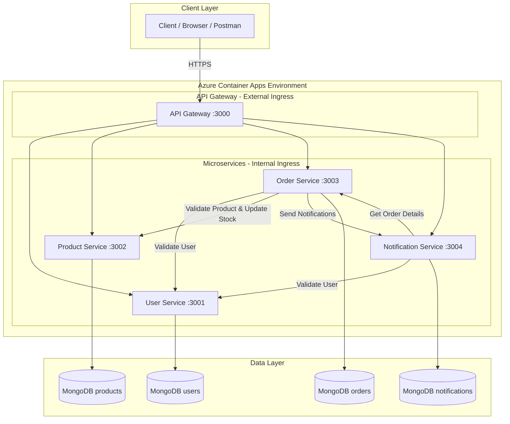

# 🛒 ShopEase - Microservice E-Commerce Platform

A secure, microservice-based e-commerce application built with **Node.js**, containerized with **Docker**, deployed on **Azure Container Apps**, and automated with **GitHub Actions** CI/CD pipelines. Integrates **DevSecOps** practices using **Snyk** and **SonarCloud**.

> **Module:** SE4010 - Current Trends in Software Engineering | SLIIT | 2026 Semester 1

---

## 📋 Table of Contents

- [Architecture Overview](#architecture-overview)
- [Microservices Description](#microservices-description)
- [Inter-Service Communication](#inter-service-communication)
- [Tech Stack](#tech-stack)
- [Project Structure](#project-structure)
- [Prerequisites](#prerequisites)
- [Local Development Setup](#local-development-setup)
- [API Documentation](#api-documentation)
- [Testing the Application](#testing-the-application)
- [Docker Configuration](#docker-configuration)
- [CI/CD Pipeline (GitHub Actions)](#cicd-pipeline-github-actions)
- [Azure Deployment Guide](#azure-deployment-guide)
- [Azure Deployment via Portal (No CLI)](#azure-deployment-via-portal-no-cli)
- [Security Measures](#security-measures)
- [DevSecOps Practices](#devsecops-practices)
- [GitHub Secrets Configuration](#github-secrets-configuration)
- [Cleanup](#cleanup)

---

## Architecture Overview



The application follows a **microservice architecture** with an **API Gateway** pattern. Each service is independently deployable, has its own database (Database per Service pattern), and communicates via **synchronous REST APIs**.

---

## Microservices Description

### 1. User Service (Port 3001)
| Aspect | Details |
|--------|---------|
| **Responsibility** | User registration, authentication, profile management |
| **Database** | MongoDB (`shopease-users`) |
| **Key Features** | JWT auth, password hashing (bcrypt), role-based access (user/admin) |
| **Endpoints** | `/api/auth/register`, `/api/auth/login`, `/api/auth/profile`, `/api/users/validate/:userId` |

### 2. Product Service (Port 3002)
| Aspect | Details |
|--------|---------|
| **Responsibility** | Product catalog CRUD, stock management |
| **Database** | MongoDB (`shopease-products`) |
| **Key Features** | Category filtering, text search, pagination, stock validation |
| **Endpoints** | `/api/products`, `/api/products/:id`, `/api/products/validate/:productId`, `/api/products/stock/:productId` |

### 3. Order Service (Port 3003)
| Aspect | Details |
|--------|---------|
| **Responsibility** | Order processing, status management |
| **Database** | MongoDB (`shopease-orders`) |
| **Key Features** | Multi-product orders, status tracking, order cancellation with stock restoration |
| **Communicates With** | User Service, Product Service, Notification Service |

### 4. Notification Service (Port 3004)
| Aspect | Details |
|--------|---------|
| **Responsibility** | In-app notifications, notification management |
| **Database** | MongoDB (`shopease-notifications`) |
| **Key Features** | Order notifications, read/unread tracking, notification history |
| **Communicates With** | User Service, Order Service |

### 5. API Gateway (Port 3000)
| Aspect | Details |
|--------|---------|
| **Responsibility** | Single entry point, request routing, rate limiting |
| **Key Features** | Reverse proxy, CORS handling, global rate limiting, health aggregation |

---

## Inter-Service Communication

```
┌─────────────────┐     ┌──────────────────┐     ┌─────────────────────┐
│  Order Service   │────▶│  User Service     │◀────│ Notification Service│
│                  │     │  (Validate User)  │     │  (Validate User)    │
│                  │     └──────────────────┘     │                     │
│                  │     ┌──────────────────┐     │                     │
│                  │────▶│ Product Service   │     │                     │
│                  │     │ (Validate Product │     │                     │
│                  │     │  & Update Stock)  │     │                     │
│                  │     └──────────────────┘     │                     │
│                  │────▶│                     │◀────│                     │
│                  │     │ Notification Svc   │     │  (Get Order Details)│
└─────────────────┘     └──────────────────┘     └─────────────────────┘
```

### Communication Flow Example: Creating an Order
1. **Order Service** → **User Service**: Validates the user exists (`GET /api/users/validate/:userId`)
2. **Order Service** → **Product Service**: Validates each product and checks stock (`GET /api/products/validate/:productId?quantity=X`)
3. **Order Service**: Creates the order in its database
4. **Order Service** → **Product Service**: Decreases stock for each item (`PATCH /api/products/stock/:productId`)
5. **Order Service** → **Notification Service**: Sends order confirmation notification (`POST /api/notifications`)

### Communication Flow: Notification Enrichment
1. **Notification Service** → **User Service**: Validates user for fetching notifications
2. **Notification Service** → **Order Service**: Gets order details for order-related notifications (`GET /api/orders/internal/:orderId`)

---

## Tech Stack

| Component | Technology |
|-----------|-----------|
| **Runtime** | Node.js 20 |
| **Framework** | Express.js |
| **Database** | MongoDB 7 (local) / MongoDB Atlas (cloud) |
| **Authentication** | JWT (jsonwebtoken) |
| **Containerization** | Docker with multi-stage builds |
| **Orchestration** | Docker Compose (local) / Azure Container Apps (cloud) |
| **CI/CD** | GitHub Actions |
| **Container Registry** | Azure Container Registry (ACR) |
| **Security Scanning** | Snyk (dependency vulnerabilities) |
| **SAST** | SonarCloud (static analysis) |
| **API Docs** | Swagger/OpenAPI via swagger-jsdoc |
| **API Gateway** | Custom Express + http-proxy-middleware |

---

## Project Structure

```
shopease/
├── .github/
│   └── workflows/
│       ├── user-service.yml          # CI/CD for User Service
│       ├── product-service.yml       # CI/CD for Product Service
│       ├── order-service.yml         # CI/CD for Order Service
│       └── notification-service.yml  # CI/CD for Notification Service
├── api-gateway/
│   ├── Dockerfile
│   ├── package.json
│   └── src/
│       └── index.js                 # Gateway with proxy routing
├── user-service/
│   ├── Dockerfile
│   ├── package.json
│   └── src/
│       ├── index.js                 # Entry point
│       ├── controllers/
│       │   └── auth.controller.js   # Auth & user logic
│       ├── middleware/
│       │   ├── auth.middleware.js    # JWT verification
│       │   └── validate.middleware.js
│       ├── models/
│       │   └── user.model.js        # Mongoose schema
│       └── routes/
│           ├── auth.routes.js
│           ├── user.routes.js
│           └── health.routes.js
├── product-service/
│   ├── Dockerfile
│   ├── package.json
│   └── src/
│       ├── index.js
│       ├── controllers/
│       │   └── product.controller.js
│       ├── middleware/
│       ├── models/
│       │   └── product.model.js
│       └── routes/
│           ├── product.routes.js
│           └── health.routes.js
├── order-service/
│   ├── Dockerfile
│   ├── package.json
│   └── src/
│       ├── index.js
│       ├── controllers/
│       │   └── order.controller.js  # Inter-service HTTP calls
│       ├── middleware/
│       ├── models/
│       │   └── order.model.js
│       └── routes/
│           ├── order.routes.js
│           └── health.routes.js
├── notification-service/
│   ├── Dockerfile
│   ├── package.json
│   └── src/
│       ├── index.js
│       ├── controllers/
│       │   └── notification.controller.js
│       ├── middleware/
│       ├── models/
│       │   └── notification.model.js
│       └── routes/
│           ├── notification.routes.js
│           └── health.routes.js
├── scripts/
│   ├── azure-setup.sh              # Azure infrastructure setup
│   └── azure-cleanup.sh            # Azure resource cleanup
├── docs/
│   └── architecture.md             # Architecture diagrams (Mermaid)
├── docker-compose.yml              # Local development orchestration
├── sonar-project.properties        # SonarCloud configuration
├── .gitignore
└── README.md                       # This file
```

---

## Prerequisites

- **Node.js** 20+ and npm
- **Docker** and **Docker Compose**
- **Azure CLI** (for cloud deployment)
- **Git**
- A **GitHub** account (public repository)
- An **Azure** account (free tier)

---

## Local Development Setup

### Option 1: Docker Compose (Recommended)

```bash
# Clone the repository
git clone https://github.com/<your-username>/shopease-microservices.git
cd shopease-microservices

# Start all services with Docker Compose
docker-compose up --build

# Services will be available at:
# API Gateway:          http://localhost:3000
# User Service:         http://localhost:3001
# Product Service:      http://localhost:3002
# Order Service:        http://localhost:3003
# Notification Service: http://localhost:3004
```

### Option 2: Run Services Individually

```bash
# Start MongoDB (requires Docker)
docker run -d --name mongo -p 27017:27017 mongo:7

# In separate terminals, start each service:

# Terminal 1 - User Service
cd user-service
cp .env.example .env
# Edit .env: set MONGODB_URI=mongodb://localhost:27017/shopease-users
npm install
npm run dev

# Terminal 2 - Product Service
cd product-service
cp .env.example .env
npm install
npm run dev

# Terminal 3 - Order Service
cd order-service
cp .env.example .env
npm install
npm run dev

# Terminal 4 - Notification Service
cd notification-service
cp .env.example .env
npm install
npm run dev

# Terminal 5 - API Gateway
cd api-gateway
cp .env.example .env
npm install
npm run dev
```

### Verify Services Are Running

```bash
# Check gateway health
curl http://localhost:3000/health

# Check individual services
curl http://localhost:3001/health
curl http://localhost:3002/health
curl http://localhost:3003/health
curl http://localhost:3004/health
```

---

## API Documentation

Each service exposes Swagger documentation:

| Service | Swagger URL |
|---------|------------|
| User Service | http://localhost:3001/api-docs |
| Product Service | http://localhost:3002/api-docs |
| Order Service | http://localhost:3003/api-docs |
| Notification Service | http://localhost:3004/api-docs |

---

## Testing the Application

### Complete End-to-End Flow

```bash
# 1. Register a new admin user
curl -X POST http://localhost:3000/api/auth/register \
  -H "Content-Type: application/json" \
  -d '{
    "name": "Admin User",
    "email": "admin@shopease.com",
    "password": "Admin@123456",
    "role": "admin"
  }'
# Save the returned token as ADMIN_TOKEN

# 2. Register a regular user
curl -X POST http://localhost:3000/api/auth/register \
  -H "Content-Type: application/json" \
  -d '{
    "name": "John Doe",
    "email": "john@example.com",
    "password": "User@123456"
  }'
# Save the returned token as USER_TOKEN

# 3. Login (if needed)
curl -X POST http://localhost:3000/api/auth/login \
  -H "Content-Type: application/json" \
  -d '{
    "email": "admin@shopease.com",
    "password": "Admin@123456"
  }'

# 4. Create products (admin only)
curl -X POST http://localhost:3000/api/products \
  -H "Content-Type: application/json" \
  -H "Authorization: Bearer <ADMIN_TOKEN>" \
  -d '{
    "name": "MacBook Pro 16",
    "description": "Apple MacBook Pro 16-inch with M3 chip",
    "price": 2499.99,
    "category": "electronics",
    "stock": 50
  }'
# Save the returned product ID as PRODUCT_ID_1

curl -X POST http://localhost:3000/api/products \
  -H "Content-Type: application/json" \
  -H "Authorization: Bearer <ADMIN_TOKEN>" \
  -d '{
    "name": "Programming T-Shirt",
    "description": "Cool coding t-shirt for developers",
    "price": 29.99,
    "category": "clothing",
    "stock": 200
  }'
# Save the returned product ID as PRODUCT_ID_2

# 5. Browse products
curl http://localhost:3000/api/products
curl "http://localhost:3000/api/products?category=electronics"

# 6. Place an order (demonstrates inter-service communication)
#    Order Service → User Service (validate user)
#    Order Service → Product Service (validate products, check stock)
#    Order Service → Product Service (update stock)
#    Order Service → Notification Service (send confirmation)
curl -X POST http://localhost:3000/api/orders \
  -H "Content-Type: application/json" \
  -H "Authorization: Bearer <USER_TOKEN>" \
  -d '{
    "items": [
      { "productId": "<PRODUCT_ID_1>", "quantity": 1 },
      { "productId": "<PRODUCT_ID_2>", "quantity": 2 }
    ],
    "shippingAddress": {
      "street": "123 Main St",
      "city": "Colombo",
      "state": "Western",
      "zipCode": "10100",
      "country": "Sri Lanka"
    }
  }'

# 7. Check user's orders
curl http://localhost:3000/api/orders \
  -H "Authorization: Bearer <USER_TOKEN>"

# 8. Check notifications (created automatically when order was placed)
curl http://localhost:3000/api/notifications \
  -H "Authorization: Bearer <USER_TOKEN>"

# 9. Update order status (admin) - triggers notification
curl -X PATCH http://localhost:3000/api/orders/<ORDER_ID>/status \
  -H "Content-Type: application/json" \
  -H "Authorization: Bearer <ADMIN_TOKEN>" \
  -d '{ "status": "shipped" }'

# 10. Cancel an order (triggers stock restoration + notification)
curl -X POST http://localhost:3000/api/orders/<ORDER_ID>/cancel \
  -H "Authorization: Bearer <USER_TOKEN>"
```

---

## Docker Configuration

### Multi-stage Dockerfile (all services follow this pattern)

```dockerfile
# Build stage - install dependencies
FROM node:20-alpine AS builder
WORKDIR /app
COPY package*.json ./
RUN npm ci --only=production

# Production stage - minimal image
FROM node:20-alpine
RUN addgroup -g 1001 -S nodejs && adduser -S nodeuser -u 1001
WORKDIR /app
COPY --from=builder /app/node_modules ./node_modules
COPY package*.json ./
COPY src/ ./src/
RUN chown -R nodeuser:nodejs /app
USER nodeuser          # Non-root user (security best practice)
EXPOSE <PORT>
HEALTHCHECK ...       # Container health monitoring
CMD ["node", "src/index.js"]
```

**Security features in Dockerfiles:**
- Multi-stage builds (smaller attack surface)
- Non-root user execution
- No dev dependencies in production image
- Health checks for container orchestration
- Alpine base image (minimal footprint)

---

## CI/CD Pipeline (GitHub Actions)

Each microservice has its own CI/CD pipeline that triggers on changes to that service's directory:

```
Push to main / PR → Lint → Test → Snyk Scan → SonarCloud → Docker Build → Push to ACR → Deploy to Azure
```

### Pipeline Stages

| Stage | Description | Trigger |
|-------|-------------|---------|
| **Test** | Install deps, lint, run tests | Push/PR |
| **Security Scan** | Snyk vulnerability + SonarCloud SAST | After test passes |
| **Build & Push** | Docker build, push to ACR | Main branch only |
| **Deploy** | Deploy to Azure Container Apps | After build succeeds |

### Path-based Triggers
Each workflow only triggers when files in its service directory change:
```yaml
on:
  push:
    paths:
      - 'user-service/**'  # Only triggers for user-service changes
```

---

## Azure Deployment Guide

> **Goal:** Move from your local Docker Compose setup (with local MongoDB) to **Azure Container Apps** for compute and **MongoDB Atlas** (free tier) for the cloud database.

### Architecture on Azure

```
┌──────────────────────────────────────────────────────────────────────┐
│                    Azure Container Apps Environment                  │
│                                                                      │
│  ┌─────────────┐   ┌─────────────────────────────────────────────┐  │
│  │  Frontend    │   │           Internal Services                 │  │
│  │  (nginx)     │──▶│  API Gateway ──▶ User Service               │  │
│  │  External    │   │               ──▶ Product Service            │  │
│  │  Ingress     │   │               ──▶ Order Service              │  │
│  │  Port 80     │   │               ──▶ Notification Service       │  │
│  └─────────────┘   └─────────────────────────────────────────────┘  │
│                                     │                                │
└─────────────────────────────────────│────────────────────────────────┘
                                      │
                              ┌───────▼────────┐
                              │ MongoDB Atlas   │
                              │ (Free M0 Tier)  │
                              │ cloud.mongodb   │
                              └────────────────┘
```

---

### Prerequisites

Before you begin, make sure you have:

- [Azure CLI](https://learn.microsoft.com/en-us/cli/azure/install-azure-cli) installed
- An **Azure account** (free tier works)
- **Docker Desktop** running (to build & push images)
- All services running locally via `docker-compose up` (to confirm everything works)

---

### Step 1 — Login to Azure & Set Subscription

```bash
# Login to Azure (opens browser)
az login

# List your subscriptions
az account list --output table

# Set the subscription you want to use
az account set --subscription "<YOUR_SUBSCRIPTION_ID>"

# Verify
az account show --query "{Name:name, ID:id}" --output table
```

---

### Step 2 — Create a Resource Group

A Resource Group is a logical container for all your Azure resources.

```bash
az group create \
  --name shopease-rg \
  --location eastus
```

> You can use any region. Run `az account list-locations -o table` to see options.

---

### Step 3 — Create Azure Container Registry (ACR)

ACR stores your Docker images so Azure Container Apps can pull from it.

```bash
# Name must be globally unique, lowercase, alphanumeric only
az acr create \
  --resource-group shopease-rg \
  --name <YOUR_UNIQUE_ACR_NAME> \
  --sku Basic \
  --admin-enabled true
```

> **Example name:** `shopeaseacr2026` — replace `<YOUR_UNIQUE_ACR_NAME>` with your chosen name throughout this guide.

Save the ACR credentials (you'll need them later):

```bash
# Get the login server
az acr show --name <YOUR_UNIQUE_ACR_NAME> --query loginServer -o tsv
# Output: <YOUR_UNIQUE_ACR_NAME>.azurecr.io

# Get admin username & password
az acr credential show --name <YOUR_UNIQUE_ACR_NAME> --query "{username:username, password:passwords[0].value}" -o table
```

---

### Step 4 — Create a MongoDB Atlas Cluster (Free Tier)

This replaces your local MongoDB. Atlas uses the same MongoDB wire protocol — **no code changes needed**, just a different connection string.

1. Go to [cloud.mongodb.com](https://cloud.mongodb.com) and sign up (free)
2. Click **Build a Database** → choose **M0 FREE** (shared cluster)
3. Choose a cloud provider & region (e.g. **Azure / East US** to keep it close to your Container Apps)
4. Name your cluster (e.g. `shopease-cluster`) → Click **Create Deployment**
5. Create a **Database User**:
   - Username: `shopease-admin`
   - Password: generate a strong password → **copy and save it**
6. Under **Network Access** → Click **Add IP Address** → **Allow Access from Anywhere** (`0.0.0.0/0`)
   > This is needed so Azure Container Apps can connect. For production, restrict to specific IPs.
7. Click **Connect** → **Drivers** → Copy the connection string. It looks like:
   ```
   mongodb+srv://shopease-admin:<password>@shopease-cluster.xxxxx.mongodb.net/?retryWrites=true&w=majority
   ```
8. Replace `<password>` with your actual password

> **Each service uses its own database** — you specify the database name in the connection string:
> - User Service: `mongodb+srv://...@shopease-cluster.xxxxx.mongodb.net/shopease-users?retryWrites=true&w=majority`
> - Product Service: `mongodb+srv://...@shopease-cluster.xxxxx.mongodb.net/shopease-products?retryWrites=true&w=majority`
> - Order Service: `mongodb+srv://...@shopease-cluster.xxxxx.mongodb.net/shopease-orders?retryWrites=true&w=majority`
> - Notification Service: `mongodb+srv://...@shopease-cluster.xxxxx.mongodb.net/shopease-notifications?retryWrites=true&w=majority`
>
> MongoDB Atlas auto-creates databases and collections on first write — no manual creation needed.

---

### Step 5 — Create the Container Apps Environment

The Container Apps Environment is the shared boundary where all your containers run. Internal services can communicate using their container app names.

```bash
az containerapp env create \
  --name shopease-env \
  --resource-group shopease-rg \
  --location eastus
```

---

### Step 6 — Build & Push Docker Images to ACR

Login to ACR from Docker, then build and push each service image:

```bash
# Login Docker to ACR
az acr login --name <YOUR_UNIQUE_ACR_NAME>

# Build and push all 6 images
docker build -t <YOUR_UNIQUE_ACR_NAME>.azurecr.io/user-service:latest          ./user-service
docker build -t <YOUR_UNIQUE_ACR_NAME>.azurecr.io/product-service:latest       ./product-service
docker build -t <YOUR_UNIQUE_ACR_NAME>.azurecr.io/order-service:latest         ./order-service
docker build -t <YOUR_UNIQUE_ACR_NAME>.azurecr.io/notification-service:latest  ./notification-service
docker build -t <YOUR_UNIQUE_ACR_NAME>.azurecr.io/api-gateway:latest           ./api-gateway
docker build -t <YOUR_UNIQUE_ACR_NAME>.azurecr.io/frontend:latest              ./frontend

docker push <YOUR_UNIQUE_ACR_NAME>.azurecr.io/user-service:latest
docker push <YOUR_UNIQUE_ACR_NAME>.azurecr.io/product-service:latest
docker push <YOUR_UNIQUE_ACR_NAME>.azurecr.io/order-service:latest
docker push <YOUR_UNIQUE_ACR_NAME>.azurecr.io/notification-service:latest
docker push <YOUR_UNIQUE_ACR_NAME>.azurecr.io/api-gateway:latest
docker push <YOUR_UNIQUE_ACR_NAME>.azurecr.io/frontend:latest
```

Verify images are in ACR:

```bash
az acr repository list --name <YOUR_UNIQUE_ACR_NAME> -o table
```

---

### Step 7 — Deploy the Backend Services (Internal Ingress)

Deploy services one by one because they depend on each other's FQDNs. Replace `<ATLAS_URI>` with your MongoDB Atlas connection string base from Step 4 (everything before the database name), and `<ACR_*>` with your ACR credentials from Step 3.

Choose a strong JWT secret:

```bash
# Generate a secret (or pick your own)
JWT_SECRET="shopease-jwt-$(openssl rand -hex 16)"
echo "Your JWT_SECRET: $JWT_SECRET"
```

#### 7a — User Service

```bash
az containerapp create \
  --name shopease-user-service \
  --resource-group shopease-rg \
  --environment shopease-env \
  --image <YOUR_UNIQUE_ACR_NAME>.azurecr.io/user-service:latest \
  --registry-server <YOUR_UNIQUE_ACR_NAME>.azurecr.io \
  --registry-username <ACR_USERNAME> \
  --registry-password <ACR_PASSWORD> \
  --target-port 3001 \
  --ingress internal \
  --min-replicas 1 \
  --max-replicas 3 \
  --env-vars \
    PORT=3001 \
    MONGODB_URI="<ATLAS_URI>/shopease-users?retryWrites=true&w=majority" \
    JWT_SECRET="<JWT_SECRET>" \
    JWT_EXPIRES_IN=24h \
    NODE_ENV=production
```

Get its internal FQDN:

```bash
USER_FQDN=$(az containerapp show --name shopease-user-service --resource-group shopease-rg --query "properties.configuration.ingress.fqdn" -o tsv)
echo "User Service: https://$USER_FQDN"
```

#### 7b — Product Service

```bash
az containerapp create \
  --name shopease-product-service \
  --resource-group shopease-rg \
  --environment shopease-env \
  --image <YOUR_UNIQUE_ACR_NAME>.azurecr.io/product-service:latest \
  --registry-server <YOUR_UNIQUE_ACR_NAME>.azurecr.io \
  --registry-username <ACR_USERNAME> \
  --registry-password <ACR_PASSWORD> \
  --target-port 3002 \
  --ingress internal \
  --min-replicas 1 \
  --max-replicas 3 \
  --env-vars \
    PORT=3002 \
    MONGODB_URI="<ATLAS_URI>/shopease-products?retryWrites=true&w=majority" \
    JWT_SECRET="<JWT_SECRET>" \
    NODE_ENV=production \
    USER_SERVICE_URL="https://$USER_FQDN"
```

```bash
PRODUCT_FQDN=$(az containerapp show --name shopease-product-service --resource-group shopease-rg --query "properties.configuration.ingress.fqdn" -o tsv)
echo "Product Service: https://$PRODUCT_FQDN"
```

#### 7c — Order Service

```bash
az containerapp create \
  --name shopease-order-service \
  --resource-group shopease-rg \
  --environment shopease-env \
  --image <YOUR_UNIQUE_ACR_NAME>.azurecr.io/order-service:latest \
  --registry-server <YOUR_UNIQUE_ACR_NAME>.azurecr.io \
  --registry-username <ACR_USERNAME> \
  --registry-password <ACR_PASSWORD> \
  --target-port 3003 \
  --ingress internal \
  --min-replicas 1 \
  --max-replicas 3 \
  --env-vars \
    PORT=3003 \
    MONGODB_URI="<ATLAS_URI>/shopease-orders?retryWrites=true&w=majority" \
    JWT_SECRET="<JWT_SECRET>" \
    NODE_ENV=production \
    USER_SERVICE_URL="https://$USER_FQDN" \
    PRODUCT_SERVICE_URL="https://$PRODUCT_FQDN"
```

```bash
ORDER_FQDN=$(az containerapp show --name shopease-order-service --resource-group shopease-rg --query "properties.configuration.ingress.fqdn" -o tsv)
echo "Order Service: https://$ORDER_FQDN"
```

#### 7d — Notification Service

```bash
az containerapp create \
  --name shopease-notification-service \
  --resource-group shopease-rg \
  --environment shopease-env \
  --image <YOUR_UNIQUE_ACR_NAME>.azurecr.io/notification-service:latest \
  --registry-server <YOUR_UNIQUE_ACR_NAME>.azurecr.io \
  --registry-username <ACR_USERNAME> \
  --registry-password <ACR_PASSWORD> \
  --target-port 3004 \
  --ingress internal \
  --min-replicas 1 \
  --max-replicas 3 \
  --env-vars \
    PORT=3004 \
    MONGODB_URI="<ATLAS_URI>/shopease-notifications?retryWrites=true&w=majority" \
    JWT_SECRET="<JWT_SECRET>" \
    NODE_ENV=production \
    USER_SERVICE_URL="https://$USER_FQDN" \
    ORDER_SERVICE_URL="https://$ORDER_FQDN"
```

```bash
NOTIFICATION_FQDN=$(az containerapp show --name shopease-notification-service --resource-group shopease-rg --query "properties.configuration.ingress.fqdn" -o tsv)
echo "Notification Service: https://$NOTIFICATION_FQDN"
```

Now update the Order Service to add the Notification Service URL (circular dependency):

```bash
az containerapp update \
  --name shopease-order-service \
  --resource-group shopease-rg \
  --set-env-vars \
    NOTIFICATION_SERVICE_URL="https://$NOTIFICATION_FQDN"
```

---

### Step 8 — Deploy the API Gateway (External Ingress)

The API Gateway is the **only** service exposed to the internet.

```bash
az containerapp create \
  --name shopease-api-gateway \
  --resource-group shopease-rg \
  --environment shopease-env \
  --image <YOUR_UNIQUE_ACR_NAME>.azurecr.io/api-gateway:latest \
  --registry-server <YOUR_UNIQUE_ACR_NAME>.azurecr.io \
  --registry-username <ACR_USERNAME> \
  --registry-password <ACR_PASSWORD> \
  --target-port 3000 \
  --ingress external \
  --min-replicas 1 \
  --max-replicas 5 \
  --env-vars \
    PORT=3000 \
    NODE_ENV=production \
    USER_SERVICE_URL="https://$USER_FQDN" \
    PRODUCT_SERVICE_URL="https://$PRODUCT_FQDN" \
    ORDER_SERVICE_URL="https://$ORDER_FQDN" \
    NOTIFICATION_SERVICE_URL="https://$NOTIFICATION_FQDN"
```

```bash
GATEWAY_FQDN=$(az containerapp show --name shopease-api-gateway --resource-group shopease-rg --query "properties.configuration.ingress.fqdn" -o tsv)
echo "API Gateway: https://$GATEWAY_FQDN"
```

---

### Step 9 — Deploy the Frontend (External Ingress)

The frontend needs a custom `nginx.conf` that points to the API Gateway's Azure FQDN instead of `api-gateway:3000`. Before building, update `frontend/nginx.conf`:

```nginx
# Change the proxy_pass line from:
proxy_pass http://api-gateway:3000;

# To:
proxy_pass https://<GATEWAY_FQDN>;
```

Then rebuild and push the frontend image:

```bash
docker build -t <YOUR_UNIQUE_ACR_NAME>.azurecr.io/frontend:latest ./frontend
docker push <YOUR_UNIQUE_ACR_NAME>.azurecr.io/frontend:latest
```

Deploy the frontend with external ingress:

```bash
az containerapp create \
  --name shopease-frontend \
  --resource-group shopease-rg \
  --environment shopease-env \
  --image <YOUR_UNIQUE_ACR_NAME>.azurecr.io/frontend:latest \
  --registry-server <YOUR_UNIQUE_ACR_NAME>.azurecr.io \
  --registry-username <ACR_USERNAME> \
  --registry-password <ACR_PASSWORD> \
  --target-port 80 \
  --ingress external \
  --min-replicas 1 \
  --max-replicas 3
```

```bash
FRONTEND_FQDN=$(az containerapp show --name shopease-frontend --resource-group shopease-rg --query "properties.configuration.ingress.fqdn" -o tsv)
echo "Frontend URL: https://$FRONTEND_FQDN"
```

> **Important:** Update the API Gateway's CORS configuration to allow the frontend's Azure domain. In `api-gateway/src/index.js`, add the frontend FQDN to the allowed origins.

---

### Step 10 — Verify the Deployment

```bash
# Check all container apps are running
az containerapp list \
  --resource-group shopease-rg \
  --output table

# Test the API Gateway health endpoint
curl https://$GATEWAY_FQDN/health

# Test product listing
curl https://$GATEWAY_FQDN/api/products

# Open the frontend in browser
echo "Open: https://$FRONTEND_FQDN"
```

---

### Step 11 — Configure CI/CD with GitHub Actions (Optional)

Automate future deployments by creating a Service Principal:

```bash
az ad sp create-for-rbac \
  --name shopease-github-actions \
  --role contributor \
  --scopes /subscriptions/<SUBSCRIPTION_ID>/resourceGroups/shopease-rg \
  --sdk-auth
```

Add these **GitHub Secrets** (Repository → Settings → Secrets and variables → Actions):

| Secret | Value |
|--------|-------|
| `AZURE_CREDENTIALS` | Full JSON output from the command above |
| `AZURE_RESOURCE_GROUP` | `shopease-rg` |
| `ACR_NAME` | Your ACR name (e.g. `shopeaseacr2026`) |
| `ACR_USERNAME` | ACR admin username |
| `ACR_PASSWORD` | ACR admin password |
| `SNYK_TOKEN` | From [snyk.io](https://snyk.io) (free for open source) |
| `SONAR_TOKEN` | From [sonarcloud.io](https://sonarcloud.io) (free for open source) |

After this, every push to `main` triggers the CI/CD pipeline to build, scan, and redeploy the changed service.

---

### Quick Reference — What Each Azure Resource Does

| Azure Resource | What It Replaces Locally | Purpose |
|---|---|---|
| **Resource Group** | — | Logical container for all resources |
| **Azure Container Registry** | Local Docker images | Stores your Docker images in the cloud |
| **MongoDB Atlas (Free M0)** | Local `mongo:7` container | Cloud database, fully compatible with Mongoose |
| **Container Apps Environment** | `docker-compose` network | Network boundary for containers |
| **Container Apps (x6)** | `docker-compose` services | Runs your containers with auto-scaling |

---

### Cleanup — Delete All Azure Resources

When you're done, delete everything to avoid charges:

```bash
# This deletes the resource group and ALL resources inside it (ACR, Container Apps, etc.)
az group delete --name shopease-rg --yes --no-wait
```

> **Note:** Your MongoDB Atlas cluster is hosted outside Azure. To delete it, go to [cloud.mongodb.com](https://cloud.mongodb.com) → your project → click **...** on the cluster → **Terminate**.

---

## Azure Deployment via Portal (No CLI)

If you prefer using the Azure Portal UI instead of terminal commands, follow these steps. You only need Docker Desktop locally to build and push images.

---

### Portal Step 1 — Create a Resource Group

1. Go to [portal.azure.com](https://portal.azure.com)
2. Search **"Resource groups"** in the top search bar → Click **+ Create**
3. Fill in:
   - **Subscription:** your subscription
   - **Resource group:** `shopease-rg`
   - **Region:** `East US` (or your preferred region)
4. Click **Review + create** → **Create**

---

### Portal Step 2 — Create Azure Container Registry (ACR)

1. Search **"Container registries"** → Click **+ Create**
2. Fill in:
   - **Resource group:** `shopease-rg`
   - **Registry name:** a globally unique name (e.g. `shopeaseacr2026`) — lowercase, alphanumeric only
   - **Location:** `East US`
   - **SKU:** `Basic`
3. Click **Review + create** → **Create**
4. After creation, go to the registry → **Settings** → **Access keys**
5. Enable **Admin user**
6. **Copy and save:**
   - Login server (e.g. `shopeaseacr2026.azurecr.io`)
   - Username
   - Password

---

### Portal Step 3 — Create a MongoDB Atlas Cluster (Free Tier)

This is done on the **MongoDB website**, not the Azure Portal.

1. Go to [cloud.mongodb.com](https://cloud.mongodb.com) and sign up (Google/GitHub login works)
2. Click **Build a Database** → choose the **M0 FREE** tier
3. Pick a cloud provider & region (choose **Azure / East US** to stay close to your Container Apps)
4. Name your cluster (e.g. `shopease-cluster`) → Click **Create Deployment**
5. **Create a Database User:**
   - Username: `shopease-admin`
   - Password: generate a strong password → **copy and save it**
6. Go to **Network Access** (left sidebar) → **Add IP Address** → select **Allow Access from Anywhere** (`0.0.0.0/0`) → Confirm
7. Go to **Database** (left sidebar) → Click **Connect** on your cluster → Choose **Drivers**
8. Copy the connection string:
   ```
   mongodb+srv://shopease-admin:<password>@shopease-cluster.xxxxx.mongodb.net/?retryWrites=true&w=majority
   ```
9. Replace `<password>` with your actual database user password

> **You don't need to manually create databases.** MongoDB Atlas auto-creates them when the services first write data. Each service uses a different database name in its `MONGODB_URI`.

---

### Portal Step 4 — Create Container Apps Environment

1. Search **"Container Apps Environments"** → Click **+ Create**
2. Fill in:
   - **Resource group:** `shopease-rg`
   - **Environment name:** `shopease-env`
   - **Region:** `East US`
   - **Environment type:** `Consumption only` (pay-per-use, cheapest)
3. Leave **Monitoring** tab defaults (you can skip Log Analytics for now)
4. Click **Review + create** → **Create**

---

### Portal Step 5 — Push Docker Images to ACR

This is the **only step that requires a terminal** — you need Docker to build and push your images.

```bash
# Login to your ACR
docker login <YOUR_ACR_NAME>.azurecr.io -u <ACR_USERNAME> -p <ACR_PASSWORD>

# Build and push all 6 images (run from project root)
docker build -t <YOUR_ACR_NAME>.azurecr.io/user-service:latest          ./user-service
docker build -t <YOUR_ACR_NAME>.azurecr.io/product-service:latest       ./product-service
docker build -t <YOUR_ACR_NAME>.azurecr.io/order-service:latest         ./order-service
docker build -t <YOUR_ACR_NAME>.azurecr.io/notification-service:latest  ./notification-service
docker build -t <YOUR_ACR_NAME>.azurecr.io/api-gateway:latest           ./api-gateway
docker build -t <YOUR_ACR_NAME>.azurecr.io/frontend:latest              ./frontend

docker push <YOUR_ACR_NAME>.azurecr.io/user-service:latest
docker push <YOUR_ACR_NAME>.azurecr.io/product-service:latest
docker push <YOUR_ACR_NAME>.azurecr.io/order-service:latest
docker push <YOUR_ACR_NAME>.azurecr.io/notification-service:latest
docker push <YOUR_ACR_NAME>.azurecr.io/api-gateway:latest
docker push <YOUR_ACR_NAME>.azurecr.io/frontend:latest
```

Verify in Portal: go to your **Container Registry** → **Repositories** — you should see all 6 images.

---

### Portal Step 6 — Create Container Apps (one by one)

For each service, go to **Container Apps** → **+ Create** and fill in the tabs below. You must create them **in this order** because later services need the FQDNs of earlier ones.

#### Common Settings (same for all)

| Tab | Field | Value |
|-----|-------|-------|
| **Basics** | Resource group | `shopease-rg` |
| **Basics** | Container app environment | `shopease-env` |
| **Container** | Image source | Azure Container Registry |
| **Container** | Registry | Your ACR name |
| **Container** | Image | (the service image) |
| **Container** | Tag | `latest` |
| **Container** | CPU & Memory | `0.25 cores / 0.5 Gi` (cheapest) |

---

#### 6a — User Service

| Tab | Field | Value |
|-----|-------|-------|
| **Basics** | Container app name | `shopease-user-service` |
| **Container** | Image | `user-service` |
| **Ingress** | Ingress | Enabled |
| **Ingress** | Ingress traffic | **Limited to Container Apps Environment** (internal) |
| **Ingress** | Target port | `3001` |

**Environment variables** (add in Container tab → Environment variables):

| Name | Value |
|------|-------|
| `PORT` | `3001` |
| `MONGODB_URI` | `mongodb+srv://shopease-admin:<password>@<cluster>.mongodb.net/shopease-users?retryWrites=true&w=majority` |
| `JWT_SECRET` | `your-strong-secret-here` |
| `JWT_EXPIRES_IN` | `24h` |
| `NODE_ENV` | `production` |

Click **Create**. After creation, go to the app → **Overview** → copy the **Application URL** (the FQDN). You'll need it for the next services.

---

#### 6b — Product Service

| Tab | Field | Value |
|-----|-------|-------|
| **Basics** | Container app name | `shopease-product-service` |
| **Container** | Image | `product-service` |
| **Ingress** | Ingress traffic | **Limited to Container Apps Environment** (internal) |
| **Ingress** | Target port | `3002` |

**Environment variables:**

| Name | Value |
|------|-------|
| `PORT` | `3002` |
| `MONGODB_URI` | `mongodb+srv://shopease-admin:<password>@<cluster>.mongodb.net/shopease-products?retryWrites=true&w=majority` |
| `JWT_SECRET` | same secret as above |
| `NODE_ENV` | `production` |
| `USER_SERVICE_URL` | `https://<USER_SERVICE_FQDN>` (from step 6a) |

Click **Create**. Copy the Application URL.

---

#### 6c — Order Service

| Tab | Field | Value |
|-----|-------|-------|
| **Basics** | Container app name | `shopease-order-service` |
| **Container** | Image | `order-service` |
| **Ingress** | Ingress traffic | **Limited to Container Apps Environment** (internal) |
| **Ingress** | Target port | `3003` |

**Environment variables:**

| Name | Value |
|------|-------|
| `PORT` | `3003` |
| `MONGODB_URI` | `mongodb+srv://shopease-admin:<password>@<cluster>.mongodb.net/shopease-orders?retryWrites=true&w=majority` |
| `JWT_SECRET` | same secret |
| `NODE_ENV` | `production` |
| `USER_SERVICE_URL` | `https://<USER_SERVICE_FQDN>` |
| `PRODUCT_SERVICE_URL` | `https://<PRODUCT_SERVICE_FQDN>` |

Click **Create**. Copy the Application URL.

---

#### 6d — Notification Service

| Tab | Field | Value |
|-----|-------|-------|
| **Basics** | Container app name | `shopease-notification-service` |
| **Container** | Image | `notification-service` |
| **Ingress** | Ingress traffic | **Limited to Container Apps Environment** (internal) |
| **Ingress** | Target port | `3004` |

**Environment variables:**

| Name | Value |
|------|-------|
| `PORT` | `3004` |
| `MONGODB_URI` | `mongodb+srv://shopease-admin:<password>@<cluster>.mongodb.net/shopease-notifications?retryWrites=true&w=majority` |
| `JWT_SECRET` | same secret |
| `NODE_ENV` | `production` |
| `USER_SERVICE_URL` | `https://<USER_SERVICE_FQDN>` |
| `ORDER_SERVICE_URL` | `https://<ORDER_SERVICE_FQDN>` |

Click **Create**. Copy the Application URL.

**Now go back to the Order Service** → **Containers** → **Edit and deploy** → add one more env var:

| Name | Value |
|------|-------|
| `NOTIFICATION_SERVICE_URL` | `https://<NOTIFICATION_SERVICE_FQDN>` |

Click **Create** to update.

---

#### 6e — API Gateway (External)

| Tab | Field | Value |
|-----|-------|-------|
| **Basics** | Container app name | `shopease-api-gateway` |
| **Container** | Image | `api-gateway` |
| **Ingress** | Ingress | Enabled |
| **Ingress** | Ingress traffic | **Accepting traffic from anywhere** (external) |
| **Ingress** | Target port | `3000` |

**Environment variables:**

| Name | Value |
|------|-------|
| `PORT` | `3000` |
| `NODE_ENV` | `production` |
| `USER_SERVICE_URL` | `https://<USER_SERVICE_FQDN>` |
| `PRODUCT_SERVICE_URL` | `https://<PRODUCT_SERVICE_FQDN>` |
| `ORDER_SERVICE_URL` | `https://<ORDER_SERVICE_FQDN>` |
| `NOTIFICATION_SERVICE_URL` | `https://<NOTIFICATION_SERVICE_FQDN>` |

Click **Create**. Copy the Application URL — this is your **public API endpoint**.

---

#### 6f — Frontend (External)

> **Before this step:** Update `frontend/nginx.conf` — change `proxy_pass http://api-gateway:3000;` to `proxy_pass https://<API_GATEWAY_FQDN>;` — then rebuild and push the frontend image from Step 5.

| Tab | Field | Value |
|-----|-------|-------|
| **Basics** | Container app name | `shopease-frontend` |
| **Container** | Image | `frontend` |
| **Ingress** | Ingress | Enabled |
| **Ingress** | Ingress traffic | **Accepting traffic from anywhere** (external) |
| **Ingress** | Target port | `80` |

No environment variables needed.

Click **Create**. The Application URL is your **live website**.

---

### Portal Step 7 — Verify

1. Open your **API Gateway** Application URL in a browser → append `/health` → You should see a health JSON
2. Open your **Frontend** Application URL → The ShopEase website should load
3. In the Portal → each Container App → **Log stream** to see live logs
4. In the Portal → each Container App → **Metrics** to monitor requests

### Portal Cleanup

1. Go to **Resource groups** → `shopease-rg`
2. Click **Delete resource group**
3. Type the name to confirm → **Delete**

This removes everything (ACR, all Container Apps, environment). Your MongoDB Atlas cluster is separate — delete it from [cloud.mongodb.com](https://cloud.mongodb.com) if no longer needed.

---

## Security Measures

### Application Security
| Measure | Implementation |
|---------|---------------|
| **Authentication** | JWT tokens with expiration |
| **Password Hashing** | bcrypt with salt rounds of 12 |
| **Input Validation** | express-validator on all endpoints |
| **Rate Limiting** | express-rate-limit (100 req/15min per IP) |
| **HTTP Headers** | Helmet.js (XSS, CSRF, clickjacking protection) |
| **CORS** | Restricted origins in production |
| **Role-based Access** | Admin/User roles with middleware checks |
| **Body Size Limits** | 10KB JSON body limit |
| **Request Logging** | Morgan for audit trail |

### Infrastructure Security
| Measure | Implementation |
|---------|---------------|
| **Non-root Containers** | All Dockerfiles use non-root user |
| **Internal Services** | Only API Gateway has external ingress |
| **Secrets Management** | Environment variables, GitHub Secrets |
| **Network Isolation** | Docker network / Container Apps environment |
| **Container Health** | Built-in health checks |
| **Multi-stage Builds** | Minimal production images |

### Security Headers Set by Helmet.js
- `X-Content-Type-Options: nosniff`
- `X-Frame-Options: SAMEORIGIN`
- `X-XSS-Protection: 1; mode=block`
- `Strict-Transport-Security` (HSTS)
- `Content-Security-Policy`

---

## DevSecOps Practices

### 1. Snyk (Dependency Vulnerability Scanning)

Sign up at [snyk.io](https://snyk.io) (free for open-source):

```bash
# Local scan
npm install -g snyk
snyk auth
cd user-service && snyk test
```

Integrated in CI/CD pipeline - scans on every push/PR.

### 2. SonarCloud (Static Application Security Testing)

1. Sign up at [sonarcloud.io](https://sonarcloud.io) with GitHub
2. Create a new project linked to your repository
3. Get the `SONAR_TOKEN` from SonarCloud
4. Update `sonar-project.properties` with your organization and project key
5. Add `SONAR_TOKEN` to GitHub Secrets

### 3. Container Security
- Alpine-based images (minimal attack surface)
- No root user in containers
- No development dependencies in production
- Regular base image updates

---

## GitHub Secrets Configuration

Complete list of secrets needed (see [Step 11](#step-11--configure-cicd-with-github-actions-optional) of Azure Deployment Guide for setup):

```
AZURE_CREDENTIALS      → Azure Service Principal JSON
AZURE_RESOURCE_GROUP   → shopease-rg
ACR_NAME               → Your ACR name
ACR_USERNAME           → ACR admin username
ACR_PASSWORD           → ACR admin password
SNYK_TOKEN             → From snyk.io account
SONAR_TOKEN            → From sonarcloud.io account
```

---

## Cleanup

### Remove Azure Resources

```bash
# Delete everything in one go (Resource Group + all resources inside)
az group delete --name shopease-rg --yes --no-wait
```

### Stop Local Development

```bash
docker-compose down -v  # Stop containers and remove volumes
```

---

## API Endpoints Summary

### User Service (`/api/auth`, `/api/users`)
| Method | Endpoint | Auth | Description |
|--------|----------|------|-------------|
| POST | `/api/auth/register` | No | Register new user |
| POST | `/api/auth/login` | No | Login user |
| GET | `/api/auth/profile` | JWT | Get current profile |
| GET | `/api/users` | Admin | List all users |
| GET | `/api/users/validate/:userId` | No* | Validate user (internal) |
| PUT | `/api/users/profile` | JWT | Update profile |

### Product Service (`/api/products`)
| Method | Endpoint | Auth | Description |
|--------|----------|------|-------------|
| GET | `/api/products` | No | List products (pagination, filter) |
| GET | `/api/products/:id` | No | Get product details |
| POST | `/api/products` | Admin | Create product |
| PUT | `/api/products/:id` | Admin | Update product |
| DELETE | `/api/products/:id` | Admin | Delete product |
| GET | `/api/products/validate/:id` | No* | Validate product (internal) |
| PATCH | `/api/products/stock/:id` | No* | Update stock (internal) |

### Order Service (`/api/orders`)
| Method | Endpoint | Auth | Description |
|--------|----------|------|-------------|
| POST | `/api/orders` | JWT | Create order |
| GET | `/api/orders` | JWT | Get user's orders |
| GET | `/api/orders/all` | Admin | Get all orders |
| GET | `/api/orders/:id` | JWT | Get order details |
| PATCH | `/api/orders/:id/status` | Admin | Update order status |
| POST | `/api/orders/:id/cancel` | JWT | Cancel order |
| GET | `/api/orders/internal/:id` | No* | Get order (internal) |

### Notification Service (`/api/notifications`)
| Method | Endpoint | Auth | Description |
|--------|----------|------|-------------|
| POST | `/api/notifications` | No* | Create notification (internal) |
| GET | `/api/notifications` | JWT | Get user notifications |
| GET | `/api/notifications/order/:id` | JWT | Get order notifications |
| PATCH | `/api/notifications/:id/read` | JWT | Mark as read |
| PATCH | `/api/notifications/read-all` | JWT | Mark all as read |
| DELETE | `/api/notifications/:id` | JWT | Delete notification |

*\* Internal endpoints - only accessible within the container network*

---

## Challenges & Solutions

| Challenge | Solution |
|-----------|----------|
| Service discovery in Docker | Docker Compose networking with service names as hostnames |
| Service startup order | `depends_on` with health checks in docker-compose |
| Shared JWT secret | Same `JWT_SECRET` env var across all services |
| Database isolation | Separate MongoDB databases per service |
| Azure free tier limits | MongoDB Atlas M0 free tier + Container Apps consumption plan |
| CI/CD path-based triggers | GitHub Actions `paths` filter per service |

---

## License

This project is for educational purposes as part of SLIIT SE4010 coursework.
