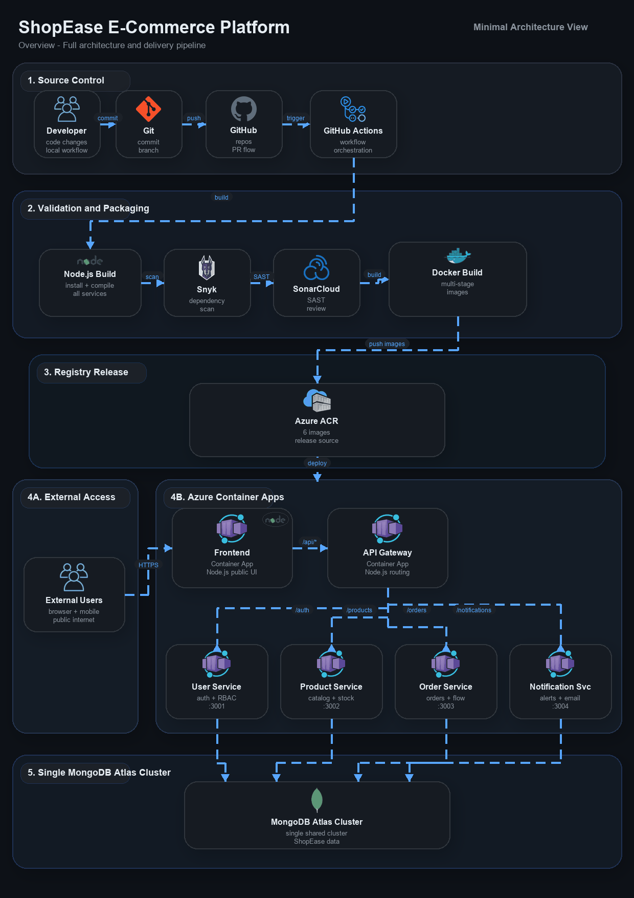

# ShopEase - Microservice E-Commerce Platform

A microservice-based e-commerce application built with **Node.js**, containerized with **Docker**, deployed on **Azure Container Apps**, and automated with **GitHub Actions CI/CD**. Integrates **DevSecOps** with **Snyk** and **SonarCloud**.

---

## Architecture



```
Client → Frontend (React) → API Gateway → Microservices → MongoDB Atlas
                                            ├── User Service       :3001
                                            ├── Product Service     :3002
                                            ├── Order Service       :3003
                                            └── Notification Service:3004
```

**Pattern:** API Gateway + Database-per-Service + Synchronous REST

### Azure Enterprise Services
| Service | Purpose |
|---------|---------|
| **Key Vault** | Secrets management via Managed Identity |
| **App Insights** | Distributed tracing & live metrics |
| **Blob Storage + CDN** | Product image storage with edge caching |
| **Service Bus** | Async order → notification messaging |

---

## Microservices

| Service | Port | Responsibility | Database |
|---------|------|---------------|----------|
| **User Service** | 3001 | Auth, registration, profiles, RBAC | `shopease-users` |
| **Product Service** | 3002 | Catalog CRUD, stock management, image upload | `shopease-products` |
| **Order Service** | 3003 | Order processing, status tracking, cancellation | `shopease-orders` |
| **Notification Service** | 3004 | In-app notifications, read/unread tracking | `shopease-notifications` |
| **API Gateway** | 3000 | Routing, CORS, rate limiting, health aggregation | — |
| **Frontend** | 80 | React SPA served via nginx | — |

### Inter-Service Communication
```
Order Service → User Service       (validate user)
Order Service → Product Service    (validate product, update stock)
Order Service → Notification Svc   (send confirmation)
Notification  → User Service       (validate user)
Notification  → Order Service      (get order details)
```

---

## Tech Stack

| Layer | Technology |
|-------|-----------|
| Runtime | Node.js 20, Express.js |
| Frontend | React, Vite, Tailwind CSS |
| Database | MongoDB Atlas (free M0) |
| Auth | JWT + bcrypt |
| Containers | Docker (multi-stage), Docker Compose |
| Cloud | Azure Container Apps, ACR, Key Vault, App Insights, Service Bus, Blob Storage, CDN |
| CI/CD | GitHub Actions (per-service pipelines) |
| Security | Snyk (SCA), SonarCloud (SAST) |

---

## Project Structure

```
shopease/
├── .github/workflows/          # CI/CD per service
├── api-gateway/                # Express reverse proxy
├── user-service/               # Auth + user management
├── product-service/            # Catalog + stock + image upload
├── order-service/              # Orders + inter-service calls
├── notification-service/       # Alerts + Service Bus consumer
├── frontend/                   # React SPA + nginx
├── docs/                       # Architecture diagrams
├── sonar-project.properties    # SonarCloud config
└── README.md
```

Each service follows the same structure:
```
<service>/
├── Dockerfile                  # Multi-stage, non-root, Alpine
├── package.json
└── src/
    ├── index.js                # Entry + App Insights init
    ├── config/keyvault.js      # Azure Key Vault integration
    ├── controllers/            # Business logic
    ├── middleware/              # Auth, validation, upload
    ├── models/                 # Mongoose schemas
    ├── routes/                 # Express routes + health
    └── services/               # Blob Storage, Service Bus, cache
```

---

## Prerequisites

- **Node.js 20+** and npm
- **Docker** and Docker Compose
- **Git**

---

## Local Development

### Docker Compose (Recommended)

```bash
git clone https://github.com/PiyumalKK/E_com_micro.git
cd E_com_micro
docker-compose up --build
```

Services available at:
| Service | URL |
|---------|-----|
| Frontend | http://localhost:5173 |
| API Gateway | http://localhost:3000 |
| User Service | http://localhost:3001 |
| Product Service | http://localhost:3002 |
| Order Service | http://localhost:3003 |
| Notification Service | http://localhost:3004 |

### Verify

```bash
curl http://localhost:3000/health
```

---

### Quick Test

```bash
# Register
curl -X POST http://localhost:3000/api/auth/register \
  -H "Content-Type: application/json" \
  -d '{"name":"Test User","email":"test@test.com","password":"Test@123456"}'

# Login
curl -X POST http://localhost:3000/api/auth/login \
  -H "Content-Type: application/json" \
  -d '{"email":"test@test.com","password":"Test@123456"}'

# Browse products
curl http://localhost:3000/api/products
```

---

## CI/CD Pipeline

```
Push to main → Lint → Test → Snyk Scan → SonarCloud → Docker Build → Push ACR → Deploy to Azure
```

Each service has its own workflow with **path-based triggers** — only the changed service rebuilds and redeploys.

---

## Security

- Multi-stage Docker builds with non-root users
- JWT authentication + bcrypt password hashing
- Rate limiting on API Gateway
- Snyk dependency scanning in CI
- SonarCloud SAST analysis
- Azure Key Vault for secrets
- Helmet.js security headers
- CORS configuration

---

## Live Deployment

| Resource | URL |
|----------|-----|
| Frontend | https://frontend.orangepond-9b6ddc9a.eastus.azurecontainerapps.io |

---
