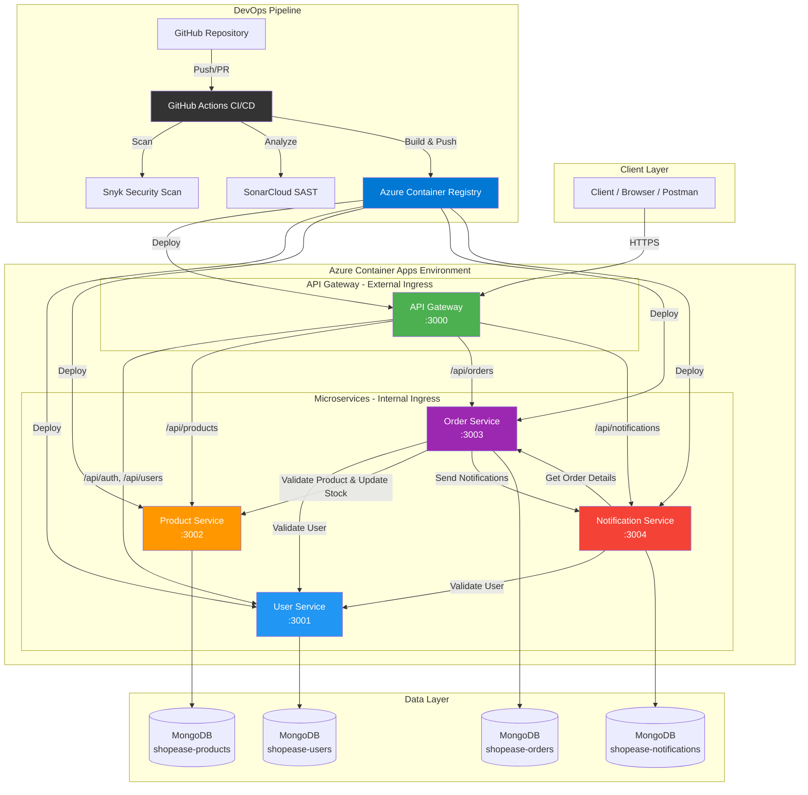
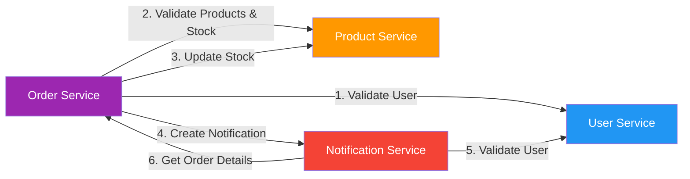

# ShopEase - Microservice E-Commerce Platform

## Architecture Diagram

```mermaid
graph TB
    subgraph "Client Layer"
        Client[Client / Browser / Postman]
    end

    subgraph "Azure Container Apps Environment"
        subgraph "API Gateway - External Ingress"
            GW[API Gateway<br/>:3000]
        end

        subgraph "Microservices - Internal Ingress"
            US[User Service<br/>:3001]
            PS[Product Service<br/>:3002]
            OS[Order Service<br/>:3003]
            NS[Notification Service<br/>:3004]
        end
    end

    subgraph "Data Layer"
        DB1[(MongoDB<br/>shopease-users)]
        DB2[(MongoDB<br/>shopease-products)]
        DB3[(MongoDB<br/>shopease-orders)]
        DB4[(MongoDB<br/>shopease-notifications)]
    end

    subgraph "DevOps Pipeline"
        GH[GitHub Repository]
        GA[GitHub Actions CI/CD]
        ACR[Azure Container Registry]
        SNYK[Snyk Security Scan]
        SONAR[SonarCloud SAST]
    end

    Client -->|HTTPS| GW
    GW -->|/api/auth, /api/users| US
    GW -->|/api/products| PS
    GW -->|/api/orders| OS
    GW -->|/api/notifications| NS

    OS -->|Validate User| US
    OS -->|Validate Product & Update Stock| PS
    OS -->|Send Notifications| NS
    NS -->|Validate User| US
    NS -->|Get Order Details| OS

    US --> DB1
    PS --> DB2
    OS --> DB3
    NS --> DB4

    GH -->|Push/PR| GA
    GA -->|Scan| SNYK
    GA -->|Analyze| SONAR
    GA -->|Build & Push| ACR
    ACR -->|Deploy| GW
    ACR -->|Deploy| US
    ACR -->|Deploy| PS
    ACR -->|Deploy| OS
    ACR -->|Deploy| NS

    style GW fill:#4CAF50,color:#fff
    style US fill:#2196F3,color:#fff
    style PS fill:#FF9800,color:#fff
    style OS fill:#9C27B0,color:#fff
    style NS fill:#F44336,color:#fff
    style ACR fill:#0078D4,color:#fff
    style GA fill:#333,color:#fff
```

## Inter-Service Communication Map

```mermaid
graph LR
    US[User Service] 
    PS[Product Service]
    OS[Order Service]
    NS[Notification Service]

    OS -->|1. Validate User| US
    OS -->|2. Validate Products & Stock| PS
    OS -->|3. Update Stock| PS
    OS -->|4. Create Notification| NS
    NS -->|5. Validate User| US
    NS -->|6. Get Order Details| OS

    style US fill:#2196F3,color:#fff
    style PS fill:#FF9800,color:#fff
    style OS fill:#9C27B0,color:#fff
    style NS fill:#F44336,color:#fff
```

## CI/CD Pipeline Flow

```mermaid
graph LR
    A[Developer Push] --> B[GitHub Actions Triggered]
    B --> C[Install & Lint]
    C --> D[Run Tests]
    D --> E[Snyk Security Scan]
    E --> F[SonarCloud SAST]
    F --> G[Docker Build]
    G --> H[Push to ACR]
    H --> I[Deploy to Azure Container Apps]

    style A fill:#333,color:#fff
    style B fill:#333,color:#fff
    style E fill:#4B0082,color:#fff
    style F fill:#CB2029,color:#fff
    style H fill:#0078D4,color:#fff
    style I fill:#4CAF50,color:#fff
```
